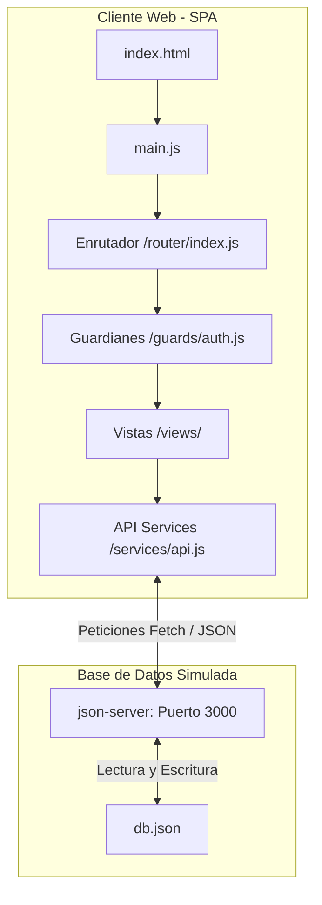

# 🎓 Documento de Sustentación del Proyecto: CineGestor SPA

Este documento sirve como **guía de presentación y defensa técnica** del proyecto **CineGestor**. Explica paso a paso cómo se construyó la aplicación, las decisiones técnicas adoptadas, la arquitectura elegida y cómo funciona la lógica del sistema.

---

## 1. 🎯 Objetivo del Proyecto

El objetivo principal fue modernizar una aplicación heredada de reserva de espacios de trabajo, transformándola en un **Sistema de Gestión de Cine y Compra de Entradas (SPA)** completamente funcional, robusto y con un diseño moderno.

Se priorizaron dos lineamientos clave:
1.  **Integridad de Datos:** Impedir conflictos de horarios en salas de cine y controlar estrictamente el aforo disponible.
2.  **Sustentabilidad Académica:** Estructurar el código de la manera más sencilla, procedimental y comentada posible, facilitando su explicación por parte de un programador de nivel básico o intermedio.

---

## 2. 🏛️ Arquitectura del Software (Single Page Application)

La aplicación está construida sobre una arquitectura de dos capas:



### Componentes Clave:
*   **Enrutador por Hash:** En vez de recargar la página, se interceptan los cambios de ruta mediante `window.location.hash` (ejemplo: `#/movies`). Esto permite que la aplicación se cargue una sola vez y se sienta instantánea.
*   **Guardias de Roles:** Las vistas de administración (`Salas`, `Estadísticas`, `Usuarios`) están protegidas en el frontend. Si la sesión activa no posee el rol de `admin`, el sistema interrumpe el enrutamiento y redirige a la pantalla de Acceso Denegado.
*   **API simulada:** Se utiliza `json-server` para levantar endpoints REST en segundos a partir de un archivo JSON (`db.json`).

---

## 3. 🛠️ El Paso a Paso del Desarrollo (Cómo se hizo)

### Paso 1: Rediseño del Modelo de Datos
Se rediseñó el archivo `api/db.json` para definir las colecciones necesarias para un cine real:
*   `users`: Cuentas con roles específicos (`admin` y `user`).
*   `salas`: Espacios con capacidad máxima y tipo de tecnología (2D, 3D, IMAX).
*   `movies`: Funciones individuales programadas. Cada función registra una película, la fecha, hora, salaId, capacidad total, cupos libres y el póster.
*   `reservations`: Historial de compras asociando el usuario con la película, la fecha de compra y los boletos adquiridos.

### Paso 2: Creación de la Estética Premium
Se implementó un diseño visual de alta fidelidad utilizando **Tailwind CSS v4** y tipografías curadas:
*   **Modo Oscuro:** Uso de paletas grises y azuladas profundas (`bg-slate-900`, `bg-slate-50`) con detalles en violeta/índigo para darle un aspecto cinematográfico moderno.
*   **Pósteres Reales:** Para que la cartelera pareciera una página real de cine, se desarrolló un mapeador inteligente de portadas que asigna imágenes de alta resolución a títulos comunes (como *El Padrino*, *Avatar*, *Gladiador*, etc.) y permite a los administradores subir portadas personalizadas a través de un campo de entrada.
*   **Feedback visual:** Integración de SweetAlert2 para alertas destructivas (como borrar funciones) y un sistema de notificaciones flotantes (Toasts) para confirmar compras.

### Paso 3: Lógica de Negocio y Anti-solapamientos
Este fue el reto lógico más importante. Para garantizar la integridad en el cine, se programaron dos validaciones críticas en tiempo real al crear o editar funciones:
1.  **Validación de Sala Ocupada:** Antes de guardar una nueva función, el sistema descarga la base de datos de cartelera y verifica si existe alguna otra película programada en la **misma sala**, la **misma fecha** y el **mismo horario**. De existir coincidencia, bloquea la acción.
2.  **Ajuste Dinámico de Aforo:** Al guardar la función, la capacidad de asientos se valida contra el máximo permitido por la sala física. En caso de edición, el sistema bloquea cualquier intento de reducir la capacidad de asientos por debajo de los boletos que los clientes ya hayan comprado.

### Paso 4: Escritura Secuencial Segura
Dado que `json-server` opera leyendo y escribiendo directamente sobre un archivo físico (`db.json`), las peticiones asíncronas en paralelo (como `Promise.all` al guardar varios horarios diarios a la vez) causaban bloqueos en el disco.
*   **Solución:** Se implementaron bucles secuenciales utilizando `for...of` combinados con `await`. Esto obliga a que el navegador complete la inserción de una función en el servidor antes de enviar la siguiente, garantizando que ninguna se pierda.

### Paso 5: Refactorización y Simplificación del Código
Para asegurar que el proyecto pudiera defenderse fácilmente en una evaluación:
*   Se eliminaron funciones flecha anidadas y métodos de JavaScript complejo (como encadenamientos masivos de `.map().reduce().join('')`).
*   Se reescribió la lógica usando funciones tradicionales (`function`) y bucles tradicionales (`for...of`, condicionales `if/else` directos).
*   Se comentaron exhaustivamente en español todas las funciones, variables y bloques clave.

---

## 4. 🔑 Algoritmos Clave del Proyecto (Explicación para Exponer)

### A. Validación de Conflicto de Horario (Anti-solapamiento)
*Ubicación: `client/src/views/MoviesView.js`*
```javascript
// Recorremos las películas para ver si otra película ya usa esa misma sala y hora
for (const time of times) {
  const conflict = movies.find(m => 
    m.estado === 'Activa' &&
    m.salaId === salaId &&
    m.fecha === fecha &&
    m.hora === time
  );

  if (conflict) {
    showToast(`La sala ya está ocupada a las ${time} HS por la película "${conflict.pelicula}".`, 'error');
    return; // Detiene el flujo e impide la petición fetch POST
  }
}
```

### B. Control y Actualización de Cupos de Asientos
*Ubicación: `client/src/views/ReservationsView.js`*
```javascript
// Al crear una reserva, primero comprobamos la disponibilidad
if (quantity > movie.cupos_disponibles) {
  showToast(`No hay suficientes asientos libres. Quedan ${movie.cupos_disponibles} cupos.`, 'error');
  return;
}

// 1. Restamos los cupos en el objeto local de la película
movie.cupos_disponibles -= quantity;
// 2. Enviamos el cambio al servidor
await apiUpdateMovie(movie.id, movie);
// 3. Registramos la reserva en el servidor
await apiCreateReservation(reservation);
```

---

## 5. 💡 Consejos para la Defensa (Cómo lucirte)
1.  **Destaca la Experiencia de Usuario (UX):** Muestra el inicio de sesión del cliente, la fluidez con la que se navega por la cartelera, y cómo los pósteres cargan automáticamente dándole aspecto premium.
2.  **Prueba el Control de Errores en Vivo:** Intenta crear una película en una sala ocupada en el mismo horario para demostrarle al jurado que el sistema valida los conflictos de forma automática.
3.  **Explica el Flujo de Datos:** Explica cómo los cambios de cupos de las películas se reflejan dinámicamente en las tarjetas de la cartelera y en el panel de estadísticas en tiempo real (Dashboard).
4.  **Habla sobre la Escalabilidad:** Puedes mencionar que elegiste usar funciones independientes y modulares en `services/api.js` para que en el futuro, si se desea migrar a una base de datos real (como Node.js, Express y PostgreSQL), solo sea necesario cambiar la URL base en el archivo de API sin tocar la lógica de las vistas.
