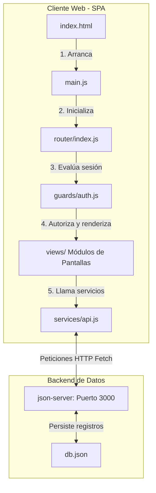

# 🎓 Guía Completa de Sustentación y Defensa Técnica: CineRiwi SPA

Este documento es tu **hoja de ruta para obtener la máxima calificación (10/10)** en la sustentación de tu proyecto. Aquí encontrarás explicaciones sencillas, la arquitectura del sistema, el flujo de desarrollo y, lo más importante, un **banco de preguntas y respuestas preparadas** ante cualquier cuestionamiento del profesor o jurado.

---

## 1. 🎯 Ficha Técnica del Proyecto

*   **Nombre del Sistema:** CineRiwi
*   **Arquitectura:** SPA (Single Page Application - Aplicación de una Sola Página)
*   **Lenguajes:** HTML5, CSS3 (Tailwind CSS v4) y JavaScript Moderno (Vanilla ES6 Módulos).
*   **Base de Datos y API:** Simulación de API REST con `json-server` mediante almacenamiento JSON local (`api/db.json`).
*   **Enfoque de Desarrollo:** Código estructurado y procedimental, libre de lógica compleja de arreglos (sin encadenamientos raros de `.map().reduce()`), priorizando bucles sencillos `for...of` y funciones declaradas tradicionales para facilitar la explicación verbal.

---

## 2. 🏛️ Arquitectura del Sistema (¿Cómo está construido?)

El proyecto está diseñado bajo el patrón de **módulos independientes**. La aplicación carga un solo archivo HTML (`index.html`) y usa JavaScript para inyectar dinámicamente el contenido de las pantallas según el hash de la URL.

### Componentes del código que debes conocer:
1.  **`main.js`**: El punto de entrada de toda la aplicación. Solo inicializa el enrutamiento.
2.  **`router/index.js`**: Escucha el cambio de dirección (`hashchange`) e inyecta la vista correspondiente en el contenedor `#app`.
3.  **`guards/auth.js`**: Administra la sesión del usuario activo en el navegador (`localStorage` o `sessionStorage`) y evalúa si tiene permiso para entrar a una ruta basándose en su rol (`admin` o `user`).
4.  **`services/api.js`**: Contiene las funciones que realizan las peticiones HTTP (`fetch`) al servidor.
5.  **`views/`**: Carpeta que contiene los archivos JS de cada pantalla. Cada vista tiene una función `render` que dibuja el HTML e instala los escuchadores de eventos (`click`, `submit`).

---

## 3. 🛠️ Principales Retos Técnicos y Cómo se Resolvieron

### Reto A: Evitar colisiones de horarios en las salas de cine (Anti-solapamiento)
*   **El problema:** El administrador no debe poder programar dos películas en la misma sala en el mismo horario.
*   **La solución:** En [MoviesView.js](file:///home/coder/pruebaJavaS/client/src/views/MoviesView.js), antes de enviar la petición de guardado, recorremos todas las funciones existentes del servidor. Usamos un condicional para verificar si coinciden el `salaId`, la `fecha` y la `hora`. Si coinciden, el sistema frena el proceso de inmediato y muestra un aviso interactivo.

### Reto B: Integridad del Aforo al Comprar y Cancelar
*   **El problema:** Mantener actualizados los cupos de asientos y evitar vender más entradas de la capacidad máxima de la sala.
*   **La solución:** Al realizar una reserva en [ReservationsView.js](file:///home/coder/pruebaJavaS/client/src/views/ReservationsView.js), se comprueba si la cantidad solicitada supera los `cupos_disponibles`. De no ser así, restamos la cantidad, actualizamos la función de la película mediante un método `PUT` en el servidor y creamos el registro de reserva. Al cancelar la reserva, le sumamos nuevamente los cupos a la película.

### Reto C: Colisiones de escritura en `json-server` (Escritura Secuencial)
*   **El problema:** Cuando el administrador agrega una película con múltiples horarios, si enviamos todas las peticiones fetch de golpe (con `Promise.all`), el servidor `json-server` colisiona al escribir al mismo tiempo en el archivo físico `db.json`.
*   **La solución:** Se implementó un bucle secuencial `for...of` con `await` para registrar una por una las funciones horarias, asegurando que cada una se guarde correctamente antes de iniciar la siguiente.

---

## 4. 🙋‍♂️ Banco de Preguntas y Respuestas para la Sustentación

Aquí tienes las preguntas que con mayor probabilidad te hará el profesor, y la respuesta exacta que debes darle:

### ❓ Pregunta 1: ¿Por qué usaste JavaScript Vanilla (puro) en lugar de un framework como React, Angular o Vue?
> **Respuesta:**  
> *"Decidimos utilizar JavaScript Vanilla con módulos ES6 para demostrar una sólida comprensión de las tecnologías fundamentales de la web (DOM, eventos y promesas) sin depender de librerías externas. Esto permite comprender en profundidad el ciclo de vida real de una aplicación: cómo se intercepta una ruta, cómo se gestiona el estado de sesión y cómo se manipula el DOM de forma directa, lo cual es muy valioso para sentar las bases antes de escalar a un framework."*

### ❓ Pregunta 2: ¿Cómo funciona el enrutador de tu aplicación? ¿Qué pasa si el usuario cambia la URL manualmente?
> **Respuesta:**  
> *"El enrutador está implementado en `router/index.js` y funciona a través de **Rutas por Hash**. Escucha el evento `hashchange` de la ventana del navegador. Si el usuario escribe manualmente en la barra de direcciones `#/movies` o hace clic en un enlace, el navegador no recarga la página; en su lugar, se dispara el evento, el enrutador analiza la ruta limpia, comprueba los permisos mediante el archivo `auth.js` y dibuja dinámicamente la vista solicitada en el contenedor `#app`."*

### ❓ Pregunta 3: ¿Qué es una API REST y cómo interactúa tu cliente con ella?
> **Respuesta:**  
> *"Una API REST es una interfaz que permite la transferencia de datos estructurados utilizando los métodos estándar del protocolo HTTP. En nuestro caso:*
> * *Usamos **GET** para consultar la lista de películas, salas o reservas.*
> * *Usamos **POST** para crear películas o registrar reservas.*
> * *Usamos **PUT** para modificar los cupos de una película o cambiar el estado de una reserva.*
> * *Usamos **DELETE** para remover una película o sala del sistema.*
> 
> *Toda esta comunicación se maneja de forma asíncrona mediante la API `fetch` en el archivo `services/api.js`, apuntando a nuestro servidor local `json-server` en el puerto 3000."*

### ❓ Pregunta 4: ¿Cómo funciona el paso de parámetros en las peticiones para unificar información?
> **Respuesta:**  
> *"Dado que `json-server` es una base de datos relacional simulada, utilizamos query parameters (parámetros de consulta en la URL) para obtener datos específicos. Por ejemplo, al validar el inicio de sesión del usuario, consultamos `/users?email=correo` para obtener solo el registro correspondiente. Para las reservas, consultamos `/reservations?usuario=nombre` para traer únicamente las compras del cliente activo. Luego, en el cliente web, asociamos el ID de la función con la lista de películas en memoria para reconstruir información combinada como la sala y el póster."*

### ❓ Pregunta 5: ¿Cómo controlas la sesión del usuario? ¿Qué diferencia hay entre LocalStorage y SessionStorage en tu código?
> **Respuesta:**  
> *"La sesión del usuario se controla en `guards/auth.js`. Cuando el usuario inicia sesión correctamente:*
> * *Si seleccionó 'Recordar sesión en este equipo', guardamos la información en `localStorage` para que la sesión continúe activa aunque el usuario cierre el navegador.*
> * *Si no la seleccionó, la guardamos en `sessionStorage`, de modo que los datos se eliminan automáticamente cuando se cierra la pestaña del navegador.*
> 
> *Al cargar la aplicación, leemos estos almacenamientos para restaurar el estado y saber qué rol tiene el usuario."*

### ❓ Pregunta 6: Si dos clientes intentaran comprar el último boleto al mismo tiempo, ¿cómo maneja la concurrencia tu aplicación?
> **Respuesta:**  
> *"En la versión actual de prototipo, la validación se realiza en el cliente comparando la cantidad de boletos solicitada contra los cupos disponibles en ese instante. Si dos usuarios envían la petición exactamente al mismo tiempo, `json-server` procesará las peticiones HTTP de manera secuencial en su cola de entrada. La primera petición modificará con éxito los cupos a 0. La segunda petición, al ser procesada en el servidor, guardará la reserva pero como mejora para producción, en un entorno con base de datos real (como Node.js + PostgreSQL), implementaríamos transacciones con bloqueo de registros (Pessimistic/Optimistic Locking) o restricciones en el backend para retornar un error 400 antes de confirmar la compra."*

### ❓ Pregunta 7: ¿Cómo implementaste el diseño cinematográfico oscuro?
> **Respuesta:**  
> *"Para lograr un diseño moderno de alta fidelidad que simulara una plataforma de streaming o cine premium sin complicar el código JavaScript de las vistas, modificamos las clases de diseño global en `client/src/style.css` y el layout de `router/index.js`.*
> * *Establecimos un fondo azul-pizarra oscuro profundo (`#020617`).*
> * *Creamos reglas CSS globales que capturan los elementos con la clase `.bg-white` para transformarlos automáticamente en tarjetas oscuras con efecto de desenfoque de fondo (glassmorphism).*
> * *Cambiamos las escalas de grises de los textos a tonos claros para un contraste ideal y adaptamos los campos de formulario y botones."*

---

## 5. 💡 Simulación del Examen de Sustentación (Paso a Paso)

Cuando te toque presentar el proyecto frente al profesor, hazlo en este orden para demostrar control absoluto:

1.  **Paso 1 (Inicio de Sesión):** Abre la pantalla de Login y muestra el diseño responsivo a doble columna. Inicia sesión como **Cliente** (`juan@cine.com`). Muestra que sólo tienes acceso a "Cartelera" y "Reservas".
2.  **Paso 2 (Hacer una Reserva):** Selecciona una película en la cartelera, escoge un horario y realiza la compra de 2 boletos. Ve a la pestaña "Reservas" y muestra tu boleto generado con el póster correspondiente.
3.  **Paso 3 (Intento de Intrusión):** Escribe manualmente en la barra de direcciones `#/rooms` o `#/dashboard` para mostrarle al profesor cómo el guardián de seguridad te redirige automáticamente a la pantalla de **Acceso Denegado**.
4.  **Paso 4 (Control de Administrador):** Cierra sesión e ingresa como **Administrador** (`admin@cine.com`). Ve al **Dashboard** y muestra las estadísticas de boletos vendidos actualizadas.
5.  **Paso 5 (Validar Conflicto):** Ve a "Cartelera", haz clic en "+ Nueva Función" e intenta agregar una película en una sala y horario que ya estén ocupados. Muestra la notificación de alerta de conflicto de sala que programamos.
