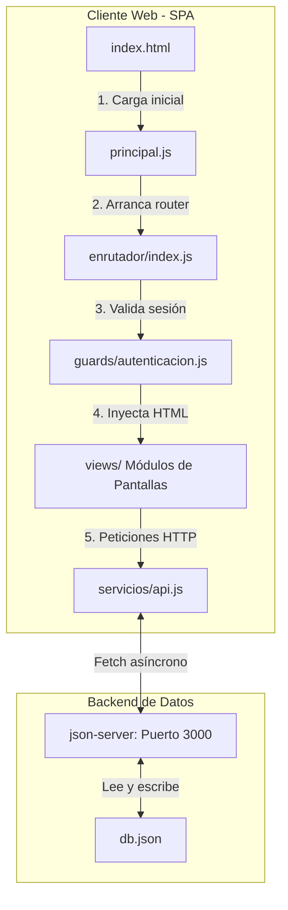

# 🎓 Guía Completa de Sustentación y Defensa Técnica: CineRiwi SPA

Este documento es tu **hoja de ruta oficial para obtener la máxima calificación (10/10)** en la sustentación de tu proyecto. Explica de manera didáctica y con código de nivel de estudiante cómo está construido el sistema, cómo interactúa el Frontend con el Backend, cómo funciona la seguridad y cómo se maneja la persistencia de datos.

---

## 1. 🎯 Ficha Técnica del Proyecto

*   **Nombre del Sistema:** CineRiwi
*   **Arquitectura:** SPA (Single Page Application - Aplicación de una Sola Página) sin frameworks pesados.
*   **Lenguajes:** HTML5, CSS3 (Tailwind CSS v4) y JavaScript Moderno (Vanilla ES6 Módulos).
*   **Base de Datos y API:** Simulación de API REST con `json-server` mediante almacenamiento JSON local (`api/db.json`).
*   **Enfoque de Desarrollo:** Código secuencial, estructurado y procedimental, libre de lógica compleja de arreglos (sin encadenamientos raros de `.map().reduce()`), priorizando bucles sencillos `for...of` y funciones declaradas tradicionales para facilitar la explicación verbal.

---

## 2. 🏛️ Arquitectura General de una SPA (Single Page Application)

Una **SPA** es una aplicación web que se carga una sola vez en el navegador (`index.html`). Cuando el usuario hace clic en los enlaces o navega, el navegador **no recarga la pestaña**. En su lugar, JavaScript intercepta el cambio de URL y redibuja la sección central del DOM.

### Flujo de Ejecución al Arrancar la Aplicación:


---

## 3. 🖥️ Explicación Detallada de Cada Vista (Módulo a Módulo)

Cada pantalla del sistema reside en `client/src/views/` y exporta una función principal `render...` que recibe el contenedor principal del DOM.

### 🔑 A. Vista de Login (`VistaLogin.js`)
*   **Función:** Permite la entrada de usuarios autenticándose por su correo y contraseña.
*   **Cómo funciona:**
    1.  Dibuja un formulario estilizado con temática de **Riwi Barranquilla** en pantalla dividida (split-screen).
    2.  Al hacer *Submit*, lee los campos `email` y `password`.
    3.  Llama a `apiFetchUserByEmail(email)` en el servicio de la API.
    4.  Si el usuario existe, compara la contraseña en texto plano.
    5.  Si es correcta, llama a `setCurrentUser(user, rememberMe)` para registrar la sesión y redirige al Dashboard (si es `admin`) o a la Cartelera (si es `user`).

### 📊 B. Vista de Dashboard (`VistaDashboard.js`)
*   **Función:** Muestra estadísticas en tiempo real y gráficos visuales sobre la taquilla.
*   **Cómo funciona:**
    1.  Obtiene películas, salas, usuarios y reservas mediante peticiones paralelas (`Promise.all`).
    2.  **Cálculo de Métricas:** Con un bucle `for...of` sobre las reservas calcula boletos vendidos, reservas confirmadas y pendientes.
    3.  **Gráfico de Barras Nivel Estudiante:** Agrupa los boletos por película en un objeto clave-valor, los ordena y renderiza un ranking de las 3 películas más vendidas. Utiliza etiquetas `div` de Tailwind CSS con anchos porcentuales dinámicos (`style="width: ${percentage}%"`) para emular un gráfico de barras interactivo sin usar librerías externas.
    4.  **Ocupación de Salas:** Cruza las funciones en cartelera con la capacidad total de cada sala (`salas`), mostrando una barra indicadora que se colorea en rojo si la sala supera el 80% de ocupación.
    5.  **Actividad Reciente:** Ordena y expone en una tabla las últimas 5 reservas procesadas.

### 🎬 C. Vista de Películas / Cartelera (`VistaPeliculas.js`)
*   **Función:** Muestra el catálogo de películas y permite al Administrador programar funciones en salas específicas.
*   **Cómo funciona:**
    1.  **Modo Cliente:** Renderiza tarjetas de películas con sus pósteres mapeados de alta calidad, salas asignadas, cupos de aforo e incluye un botón "Reservar".
    2.  **Modo Administrador:** Muestra botones para "+ Nueva Función" y "Eliminar".
    3.  **Prevención de Choques/Solapamiento:** Antes de guardar una nueva función, el código recorre en un bucle `for...of` todas las películas en cartelera. Compara si existe alguna función programada en la **misma sala (`salaId`), misma fecha (`fecha`) y mismo horario (`hora`)**. Si hay coincidencia, frena el flujo y muestra una alerta con `SweetAlert2`.
    4.  **Escritura Secuencial:** Para evitar colisiones en `json-server` al agregar horarios múltiples, el código realiza peticiones `POST` individuales de forma ordenada en un bucle utilizando `await` en cada paso.

### 🍿 D. Vista de Salas (`VistaSalas.js`)
*   **Función:** Permite al administrador crear, editar y eliminar salas físicas del cine.
*   **Cómo funciona:**
    1.  Renderiza un listado con las especificaciones de cada sala: Nombre, Capacidad de asientos, Tipo (2D, 3D, IMAX) y Estado (Activa, En Mantenimiento).
    2.  Permite abrir un modal interactivo para crear o editar salas, validando que la capacidad no sea menor a cero antes de guardar la información en `/salas`.

### 🎟️ E. Vista de Reservas (`VistaReservas.js`)
*   **Función:** Permite a los clientes comprar boletos y ver su historial, y a los administradores auditar todas las reservas.
*   **Cómo funciona:**
    1.  **Filtros Interactivos:** Contiene un buscador dinámico por nombre de cliente y un filtro por estado de reserva (Confirmada, Pendiente, Cancelada).
    2.  **Integridad de Aforo (Proceso de Compra):** Al registrar una reserva, se verifica si hay suficientes `cupos_disponibles`. Si es así, se resta la cantidad del aforo, se actualiza la película con un método `PUT` en `/movies/:id` y luego se crea la reserva con un `POST` en `/reservations`.
    3.  **Proceso de Cancelación:** Si se cancela la reserva, se le devuelve el aforo a la película sumando los cupos correspondientes en el servidor.

### 👥 F. Vista de Usuarios (`VistaUsuarios.js`)
*   **Función:** Directorio administrativo y gestión de todas las cuentas registradas en el sistema.
*   **Cómo funciona:**
    1.  **Métricas Rápidas:** Muestra tarjetas dinámicas con el total de usuarios, cuántos son administradores, cuántos clientes y la suma de boletos activos.
    2.  **Registro de Usuarios (Creación):** Incorpora un botón `➕ Registrar Usuario` que abre un formulario modal interactivo para crear cuentas directamente (Admin o Cliente) ingresando Nombre, Correo, Contraseña y Rol, verificando previamente que el correo no esté duplicado.
    3.  **Actualización de Privilegios (Rol):** El botón `🔄 Cambiar Rol` permite al administrador cambiar el rol del usuario de cliente a administrador (o viceversa) con confirmación interactiva.
    4.  **Eliminación Segura:** El botón `🗑️ Eliminar` permite purgar una cuenta del sistema, validando antes mediante la sesión que el administrador activo no pueda eliminarse a sí mismo.

---

## 4. 🔗 Conexión Frontend-Backend (Consumo de la API REST)

Toda la comunicación con el servidor de datos ocurre en `client/src/servicios/api.js` mediante la API `fetch` nativa del navegador.

### La Función Centralizada `request()`:
Para no duplicar código, se creó una función genérica que maneja las cabeceras JSON, convierte las respuestas y captura errores:

```javascript
async function request(endpoint, options = {}) {
  const url = `${BASE_URL}${endpoint}`;
  const headers = {
    'Content-Type': 'application/json',
    ...options.headers
  };
  
  const response = await fetch(url, { ...options, headers });
  
  if (!response.ok) {
    throw new Error(`Error en servidor: ${response.status}`);
  }
  
  if (response.status === 204) return true; // Código de éxito sin contenido
  return await response.json();
}
```

### Ejemplos de Consumo de Endpoints:
*   **GET (Obtener películas):** `request('/movies')` $\rightarrow$ Retorna un array con todas las películas.
*   **POST (Crear reserva):** `request('/reservations', { method: 'POST', body: JSON.stringify(reservaData) })`.
*   **PUT (Modificar película):** `request('/movies/1', { method: 'PUT', body: JSON.stringify(movieData) })`.
*   **DELETE (Borrar sala):** `request('/salas/2', { method: 'DELETE' })`.

---

## 5. 💾 Persistencia de Datos (Base de Datos y Sesiones)

La persistencia de datos se gestiona en dos niveles distintos:

### A. Persistencia en el Servidor (Base de Datos):
*   El backend utiliza `json-server` sobre el archivo físico `api/db.json`.
*   Cada vez que realizamos una petición `POST`, `PUT` o `DELETE`, `json-server` escribe directamente en el archivo `db.json`, asegurando que la información de las películas, salas, usuarios y reservas no se pierda al reiniciar la aplicación.

### B. Persistencia en el Cliente (Sesiones del Navegador):
Se administra en `guards/autenticacion.js` usando las APIs del navegador:
*   **`localStorage`:** Si el usuario selecciona "Recordar sesión", guardamos sus datos aquí. Los datos persisten incluso después de cerrar y abrir el navegador.
*   **`sessionStorage`:** Si no selecciona "Recordar sesión", se guarda aquí. La sesión se destruye automáticamente al cerrar la pestaña.

---

## 6. 🛡️ Seguridad y Control de Acceso (Guards)

La seguridad está implementada del lado del cliente mediante un sistema de **Guardianes de Ruta** configurado en `guards/autenticacion.js`.

### El Mapa de Reglas (`routeRules`):
Definimos los privilegios de cada ruta del sistema:

```javascript
const routeRules = {
  '/': { requiresAuth: true },
  '/login': { guestOnly: true },
  '/dashboard': { requiresAuth: true, role: 'admin' },
  '/movies': { requiresAuth: true },
  '/rooms': { requiresAuth: true, role: 'admin' },
  '/reservations': { requiresAuth: true },
  '/users': { requiresAuth: true, role: 'admin' }
};
```

### Lógica del Guardián (`checkRouteAccess`):
Cada vez que el usuario navega a una ruta en el enrutador:
1.  **Regla 1 (Usuario no logueado):** Si la ruta tiene `requiresAuth: true` y no hay una sesión activa, lo redirige automáticamente a `#/login`.
2.  **Regla 2 (Invitado intentando entrar al login):** Si la ruta tiene `guestOnly: true` (como `/login`) y el usuario ya está autenticado, lo redirige a su panel principal según su rol.
3.  **Regla 3 (Acceso no autorizado por Rol):** Si un cliente normal intenta acceder a una ruta administrativa como `#/dashboard`, `#/rooms` o `#/users` (que requieren `role: 'admin'`), el guardián deniega el acceso y lo redirige a la vista `#/access-denied` (Acceso Denegado).

---

## 7. 🙋‍♂️ Banco de Preguntas Académicas (Q&A)

### ❓ Pregunta 1: ¿Por qué no utilizaste base de datos SQL como MySQL o PostgreSQL?
> **Respuesta:** *"Para el alcance de este proyecto académico y la defensa de la arquitectura del Frontend, un motor relacional completo agregaría complejidad en el despliegue del evaluador. Al usar `json-server`, simulamos el comportamiento exacto de una API RESTful con persistencia real sobre un archivo plano JSON (`db.json`), lo que simplifica la demostración y permite concentrarnos en la lógica de negocio y enrutamiento del lado del cliente."*

### ❓ Pregunta 2: ¿Cómo evitas que un usuario inyecte código malicioso en tus formularios?
> **Respuesta:** *"Al construir el HTML dinámicamente y asignar los valores de los inputs mediante la lectura del atributo `.value` del DOM, el navegador trata estos datos como cadenas de texto puro y no como código ejecutable. Además, al enviarlos al backend con Fetch convertidos a formato JSON, se mitigan los riesgos de inyección de scripts básicos del lado del cliente."*

### ❓ Pregunta 3: ¿Qué es el método `Promise.all` que utilizas en tus vistas?
> **Respuesta:** *"Es un método que nos permite ejecutar múltiples peticiones HTTP (promesas asíncronas) de forma paralela en lugar de esperar a que termine una para iniciar la siguiente. Esto optimiza drásticamente el tiempo de carga del Dashboard y de las vistas, ya que solicitamos películas, usuarios y reservas de manera simultánea."*

### ❓ Pregunta 4: ¿Por qué se utilizó un bucle secuencial en lugar de `Promise.all` al guardar horarios múltiples?
> **Respuesta:** *"Debido a que `json-server` almacena los datos en un único archivo físico (`db.json`), si intentamos realizar varias escrituras simultáneas con `Promise.all`, el servidor choca consigo mismo al intentar escribir en el disco al mismo tiempo, lo que corrompe el archivo. Para solucionarlo, usamos un bucle `for...of` con `await` para forzar una escritura secuencial y ordenada en el disco del servidor."*

---

## 8. 💡 Simulación de Exposición Paso a Paso

1.  **Inicio de Sesión:** Entra a `#/login`, destaca el diseño con la temática de **Riwi Barranquilla** y accede como cliente (`juan@cine.com`).
2.  **Reserva:** Escoge una película, selecciona entradas y compra. Ve a "Reservas" y muestra tu boleto.
3.  **Intrusión:** Modifica manualmente la URL a `#/rooms` en el navegador para mostrar cómo el **Guardián de Seguridad** te bloquea.
4.  **Admin:** Entra como administrador (`admin@cine.com`), muestra las estadísticas y el gráfico de barras nativo en el **Dashboard**.
5.  **Conflicto:** Ve a Cartelera e intenta crear una función en la misma sala, fecha y hora de otra película existente para demostrar la validación anti-solapamiento.
